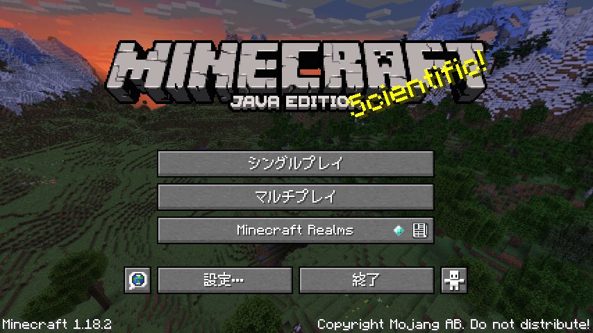
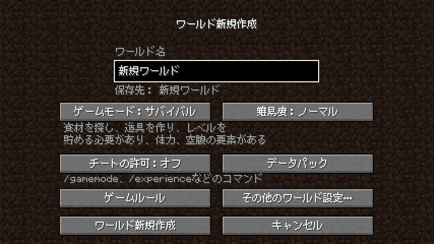

# minecraft-mplus
マイクラの日本語文字のリソースパック

このリソースパックは [M+ BITMAP FONTS](https://mplus-fonts.osdn.jp/mplus-bitmap-fonts/) の M+ gothic 10r のフォントを使っている

This resource pack uses the M+ gothic 10r font from [M+ BITMAP FONTS](https://mplus-fonts.osdn.jp/mplus-bitmap-fonts/)
